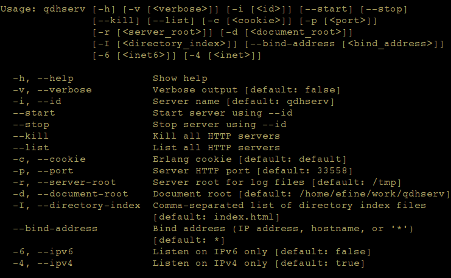

# qdhserv - A Quick and Dirty HTTP Server #

Copyright (c) 2016 Fine Computer Consultants, Inc.

__Authors:__ Edwin Fine ([`efine@myfcci.com`](mailto:efine@myfcci.com)).

Wouldn't it be nice to have a little server utility with which you can
add and remove served directories? `qdhserv` is a quick and dirty Erlang
escript which does just that.<p></p>
<br></br>



### <a name="Examples">Examples</a> ###

```bash

# Start server on doc subdirectory with default port of 33558
qdhserv --start -d $(pwd)/doc --id 'docs'

# Display tab-delimited list of servers
$ qdhserv --list
docs	any	33558

# Start another server
$ qdhserv --start --id foobar_logs --port 33559 -d ~/var/log/foobar.log

# Kill all servers
qdhserv --kill

```


### <a name="Rationale">Rationale</a> ###

When you work with a lot of generated documentation that needs a web
browser to view, and you work across many VMs and the like, so the
documentation isn't always on your local system, it gets tiring

You could always use Python to do something like this:

```python

import SimpleHTTPServer
import SocketServer

PORT = 5678

Handler = SimpleHTTPServer.SimpleHTTPRequestHandler

httpd = SocketServer.TCPServer(("", PORT), Handler)

print "serving at port", PORT
httpd.serve_forever()

```
But after a while, you get a bunch of Python interpreters running on
different ports and it gets a bit out of hand. Of course, you could
write a nice Python utility to do better than that, but Erlang's really
great on multiprocessing. And I like it, so there!

## Modules ##


<table width="100%" border="0" summary="list of modules">
<tr><td><a href="http://github.com/efine/qdhserv/blob/master/doc/qdhserv.md" class="module">qdhserv</a></td></tr>
<tr><td><a href="http://github.com/efine/qdhserv/blob/master/doc/qdhserv_cmdline.md" class="module">qdhserv_cmdline</a></td></tr>
<tr><td><a href="http://github.com/efine/qdhserv/blob/master/doc/qdhserv_main.md" class="module">qdhserv_main</a></td></tr>
<tr><td><a href="http://github.com/efine/qdhserv/blob/master/doc/qdhserv_types.md" class="module">qdhserv_types</a></td></tr>
<tr><td><a href="http://github.com/efine/qdhserv/blob/master/doc/qdhserv_util.md" class="module">qdhserv_util</a></td></tr></table>

